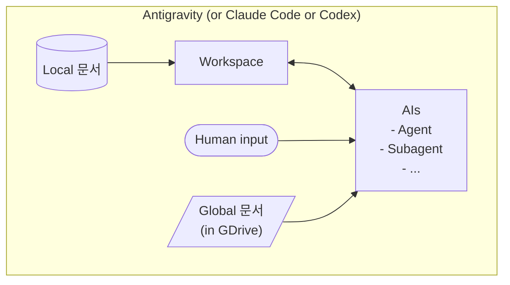
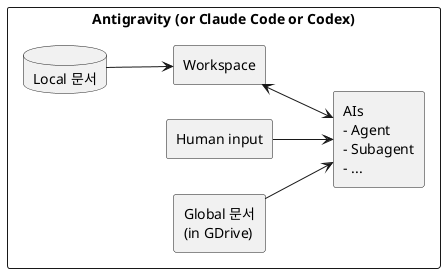

# Conitens Architecture (Formalized from Sketch)

## 1) System Boundary
Conitens 작업은 사용자가 원하는 목표를 AI와 함께 정립하고, 혼합 및 단독 AI 모델에서 Agent control을 Context가 흔들리지 않고 이어지도록 돕습니다. Workspace가 바뀌는 경우를 대비해, Global 문서는 드라이브 연동 (GDrive)을 사용합니다.

## 2) Canonical Architecture Diagram (Mermaid)

### 해석 가이드
- `Local 문서 -> Workspace`: 로컬 기준서/정책/명세가 작업 대상 공간(코드·태스크 상태)에 반영되는 **기준 데이터 주입 경로**입니다.
- `Workspace <-> AIs`: AIs는 Workspace를 읽어 계획·구현·검증을 수행하고, 다시 결과를 Workspace에 기록하는 **핵심 실행 루프(양방향 I/O)** 입니다.
- `Human input -> AIs`: 사람의 목표·우선순위·피드백은 AIs의 의사결정에 직접 들어가는 **상위 제어 입력(Control Plane)** 입니다.
- `Global 문서(in GDrive) -> AIs`: 조직 공통 정책/레퍼런스는 AIs에 **참조 컨텍스트**로 공급되며, 필요 시 판단 근거로 사용됩니다.
- 시스템 경계(SYS)는 위 흐름이 허용되는 **신뢰 실행 구역(Trusted Runtime Envelope)** 을 나타냅니다.
- 도식상 화살표 방향은 데이터 책임 방향을 의미하며, 특히 Workspace와 AIs는 반드시 상호작용(양방향)으로 유지됩니다.
- AIs 노드의 `Agent / Subagent` 계층은 단일 모델 호출이 아니라 **역할 분해된 협업 실행 단위**임을 명시합니다.
- Conitens 관점에서 이 구조는 "문서-워크스페이스-에이전트-인간"의 폐루프를 통해 품질 게이트(verify/close)와 추적성을 강화합니다.

## 3) (Optional) PlantUML Fallback

## 4) Future Direction for Conitens (Based on This Architecture)

### A. Context Governance Layer (문서 입력 거버넌스)
- Local/Global 문서 입력을 통합 규격으로 표준화하여, AIs가 어떤 문서를 언제 참조했는지 provenance(출처)를 자동 기록.
- Global 문서(GDrive)는 동기화 시점/버전/권한을 메타데이터로 남겨 재현성과 감사성을 강화.

### B. Workspace-Centric Execution Kernel (실행 커널 고도화)
- Workspace<->AIs 양방향 루프를 이벤트 기반으로 전환(예: task state change, verify result, error finding).
- Agent/Subagent별 변경 영향도와 책임 경계를 기록해 충돌을 줄이고 병렬 처리 효율을 높임.

### C. Human-in-the-Loop Control Plane 강화
- Human input을 단순 프롬프트가 아니라 "요구사항/승인/우선순위/리스크 허용치" 구조화 입력으로 모델링.
- 중요한 분기(보안, 배포, 파괴적 변경)는 명시적 승인 게이트를 통과해야 다음 단계로 진행하도록 정책화.

### D. Multi-Agent Capability Model
- AIs 내부 계층(Agent/Subagent)을 역할 템플릿으로 정의(Planner, Implementer, Validator, Reviewer).
- 요청 유형별로 필요한 서브에이전트를 동적으로 활성화해 토큰/시간/정확도 비용 최적화.

### E. Reliability & Explainability by Design
- 각 화살표별 로그 스키마를 정의해 "입력-판단-수정-검증" 체인을 자동 수집.
- 결과 보고 시 Workspace diff + 참조 문서 + Human decision trail을 함께 제시해 설명가능성 확보.

### F. Product Functionality Expansion
- "문서 유입(Local/Global) → 실행(AIs) → 결과(Workspace)" 파이프라인을 API화해 외부 도구와 연동.
- 대시보드에서 현재 작업의 문서 의존도, 에이전트 기여도, 검증 상태를 실시간 시각화.
- 장기적으로는 프로젝트별 운영 정책(보안 강도, 검증 수준, 승인 규칙)을 프로파일로 제공.
