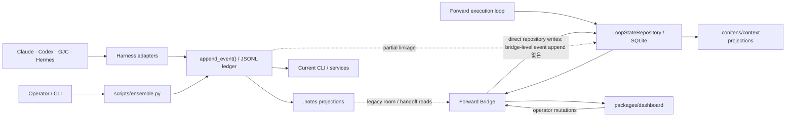
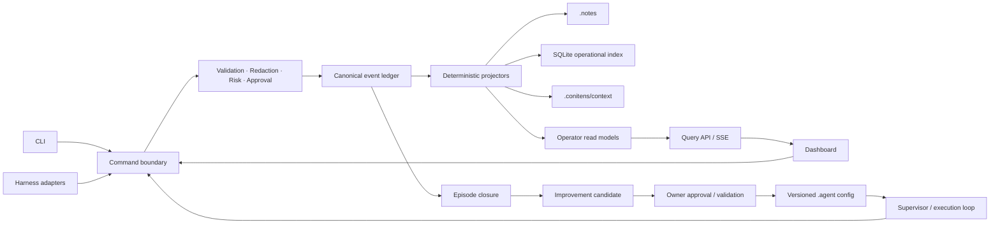

# Conitens 목표 아키텍처·제품 방향·리팩토링 계획

- 작성일: 2026-07-10
- 상태: Accepted, staged execution in progress
- 기준 범위: 현재 활성 Python control plane, Forward Bridge, `packages/dashboard`,
  `.agent`, `.notes`, `.conitens`, `.vibe`
- 제외 범위: `packages/command-center`의 신규 기능 확장, TypeScript control plane 승격,
  vector DB/embedding 도입, 전면 재작성

## 0. 실행 상태 (2026-07-11)

이 문서는 더 이상 제안만인 문서가 아니다. 다만 전체 리팩토링이 끝났다는 뜻도
아니다. 현재 저장소 근거로 닫힌 범위와 남은 범위는 다음과 같다.

| Wave | 상태 | 현재 판정 |
|---|---|---|
| 0 | 완료 | ADR-0004와 state-owner/direct-write inventory가 authority 및 promotion gate를 고정한다. |
| 1 | 완료 | append/redaction/rebuild 및 public-boundary behavior lock이 존재한다. |
| 2 | 완료 | room, meeting, handoff, spawn, stop의 event-before-projection 경계와 Forward public serialization이 잠겼다. |
| 3 | 미완료 | Forward bridge의 query/command/transport/storage 책임 분리와 room/handoff primary read path 수렴이 남았다. |
| 4 | 부분 완료 | Spatial Lens와 일부 dashboard feature 경계는 개선됐지만 `App` thin shell 및 operator API domain split의 전체 완료 근거는 없다. |
| 5 | bounded vertical slice 완료 | episode closure → candidate → owner-gated skill revision → exact-key post-apply effect observation이 연결됐다. 다른 materializable target family는 의도적으로 포함하지 않았다. |
| 6 | 결정 완료, 정리 미완료 | 선택 B인 Forward 격리를 채택했다. 문서와 ADR은 정렬됐지만 중복 execution owner/bridge 책임 정리는 Wave 3 후속 작업이다. |

따라서 다음 구현 우선순위는 Wave 3이다. Wave 5의 다른 target family 확장이나
Forward 승격보다 bridge query/command 책임 분리와 primary read-path 수렴을 먼저
완료해야 한다.

## 1. 결론

Conitens는 **다른 에이전트 런타임을 대체하는 실행 엔진**이 아니라,
**여러 모델·하네스가 수행한 일을 이벤트로 통제하고, 승인·검증·재생 가능한
증거를 통해 다음 실행의 skill/workflow/agent topology를 개선하는 self-improving
agent control center**로 가는 것이 맞다.

이 방향에서 가장 먼저 해결할 문제는 기능 부족이 아니다. 현재 저장소에는
다음 두 상태 계보가 동시에 존재한다.

1. `scripts/ensemble.py` + `scripts/ensemble_*.py` + `.notes` + `.agent`를 중심으로 한
   현재 운영 계보
2. `LoopStateRepository`의 SQLite 상태 + `.conitens/context` + Forward Bridge를
   중심으로 한 forward 계보

두 계보가 공존하는 것 자체보다, **어느 상태가 workspace의 영속 권위이고 어느
상태가 실행 중 operational state 또는 projection인지 문서와 코드가 일치하지
않는 것**이 핵심 위험이다.

따라서 권장 전략은 다음 세 문장으로 요약된다.

1. **Event ledger를 workspace durable truth로 고정한다.** `.notes`와 dashboard는
   projection이며, Forward SQLite는 승격 전까지 bounded execution state/index다.
2. **기존 CLI와 파일 경로는 facade로 유지하고 내부 책임만 작은 단위로 이동한다.**
   `ensemble.py`를 교체하거나 Python을 TypeScript로 재작성하지 않는다.
3. **리팩토링 순서는 테스트 잠금 → authority 위반 제거 → bridge query/command
   분리 → dashboard shell 분해 → improvement loop 완성 순으로 한다.**

## 2. 분석에 사용한 근거

### 2.1 대화와 사용자 방향

프로젝트 세션 기록에서 반복된 요구는 일관된다.

- 채팅과 실행 기록을 모아 skill과 workflow를 개선하는 agent control center
- Supervisor가 작업에 맞춰 subagent/sub-subagent 구조를 동적으로 구성
- Codex, Claude Code, GJC 등 서로 다른 모델과 하네스 사이의 토론·정보 공유 지원
- Hermes 철학처럼 자율 개선하되 위험하거나 중요한 변경은 승인 또는 문서화
- 원문 전체가 아니라 episode 단위 요약, 실패 사례, debate insight, 반복 workflow,
  token/time 최적화 신호를 학습 재료로 사용
- 개선 결과는 skill patch, workflow version, agent hierarchy 제안으로 남기고,
  Supervisor가 필요한 것만 선택
- 성공률, 개인화, token/time 절감을 개선 효과로 측정

동시에 사용자가 명시한 안전 경계도 반복된다.

- Hermes/GJC/다른 harness는 stateful shell 또는 evidence source이지 control-plane
  authority가 아니다.
- raw transcript, prompt/completion, stdout/stderr를 control event에 넣지 않는다.
- browser-visible operator payload에 absolute local path, username, token,
  secret-bearing raw string을 노출하지 않는다.
- `.notes`를 직접 durable truth로 갱신하지 않는다.
- agent의 완료 주장보다 validator/approval artifact를 신뢰한다.
- critical operator semantics를 pixel art 위에만 표현하지 않는다.

### 2.2 현재 문서와 코드

- `CONITENS.md`와 `docs/adr-0001-control-plane.md`는 현재 active runtime truth를
  Python `ensemble` + `.notes` + `.agent`로 둔다.
- `docs/adr-0002-product-surface-persistent-agents.md`는 `.notes`를 event projection,
  `.agent`를 canonical config surface로 둔다.
- `docs/current-architecture-status-ko.md`는 forward stack 내부에서 SQLite가
  `runs`, `iterations`, `messages`, `approval_requests` 등의 owner라고 설명한다.
- `scripts/ensemble_events.py::append_event()`는 event validation, raw-field rejection,
  redaction, append를 한 경계에서 수행한다.
- `scripts/ensemble_obsidian.py::rebuild_all()`은 event replay로 `.notes` projection을
  재생성하는 기준 경로다.
- `scripts/ensemble_forward_bridge.py`는 파일과 과거 문서에서 read-only bridge로
  설명되지만, 실제로 task/workspace CRUD, approval decision/resume를 처리한다.
- `packages/dashboard/src/App.tsx`는 route, stream, data loading, mutation,
  demo fallback, screen rendering을 한 컴포넌트에서 조정한다.
- `packages/command-center`는 현재 제품 경로가 아니라 reference/parity surface다.

### 2.3 구조 감사 결과

전체 tracked source 658개에 대한 구조 감사 결과는 다음 신호를 보였다.

- dependency cycle: 0
- large/complex function: 75
- large file: 50
- swallowed error cue: 108
- duplicate shape group: 45
- weak-test cue: 18
- `packages/dashboard/src/App.tsx`: 약 2,746 LOC, `App` complexity 685
- `scripts/ensemble.py`: 현재 working tree 기준 약 5,683 LOC
- `scripts/ensemble_forward_bridge.py`: 약 4,137 LOC
- `scripts/ensemble*.py`: 합계 약 36K LOC

이 수치는 자동 휴리스틱이므로 그대로 작업량으로 해석하면 안 된다. 특히 큰
파일 상당수는 reference-only인 `packages/command-center`에 있다. 반면 dependency
cycle이 없다는 점은 **공개 facade를 유지하면서 leaf module로 점진 분리하기에
유리한 구조**라는 의미가 있다.

감사 원본은 `.audit/repo-structure-lens/`에 있다. 이 디렉터리는 generated
review evidence이며 architecture source of truth가 아니다.

## 3. 현재 아키텍처 진단



### 3.1 잘 유지해야 할 부분

- `append_event()`에 redaction과 forbidden-field policy가 모여 있다.
- approval과 verify gate가 코드·테스트·사용자 방향 모두에서 비협상 조건이다.
- `.notes` projection은 rebuild 경로를 갖고 있다.
- external harness integration은 metadata-only evidence로 제한된다.
- Forward Bridge에는 loopback/auth boundary가 있다.
- dashboard에는 parser와 pure view-model 모듈이 이미 생겨 있다.
- episode closure는 L0/L1 public artifact와 L2 evidence bundle의 초기 형태를 갖췄다.

### 3.2 즉시 해결해야 할 불일치

#### P0 — Event commit point 위반

확인된 위반에는 `ensemble_room.py`, `ensemble_meeting.py`, `ensemble_spawn.py`의
일부 경로가 있다. 이 경로들은 event를
append하기 전에 room metadata/log, meeting transcript/summary, spawn record 또는
SQLite를 쓴다. 중간 crash가 발생하면 projection/state는 존재하지만 event가 없는
상태가 될 수 있다. 이는 `events/*.jsonl`가 sole commit point라는 계약과 충돌한다.
이는 전수 목록이 아니므로 Wave 0 inventory가 추가 위반을 확인해야 한다.

#### P0 — Bridge 문서와 실제 mutation 경계 불일치

Forward Bridge는 read-only라는 이름과 문서를 유지하면서 `POST`, `PATCH`,
`DELETE`로 operator task/workspace/approval 상태를 변경한다. 더 중요한 문제는 일부
HTTP handler가 `LoopStateRepository`를 직접 호출해 transport, policy, command,
storage 책임을 한 곳에 섞는다는 점이다. 현재 bridge 파일에는 `append_event()` 호출이
없으므로, operator mutation과 patch-approval shortcut이 event ledger를 우회하는지도
별도 command inventory에서 명시적으로 판정해야 한다.

또한 현재 bridge는 operator workspace의 `path` 문자열을 저장하고 detail row에 다시
노출하므로 browser-visible absolute path 비노출이 전수 보장되지 않는다. 기존
read-only evidence payload의 redaction만으로 안전하다고 가정하지 않고 Wave 1의
leakage characterization에서 별도로 잠근다.

#### P0 — 두 durable owner의 관계 불명확

현재 운영 문서는 event ledger를 최상위 권위로 두지만 forward 문서는 SQLite를
forward 내부 owner로 둔다. 이 둘의 관계가 transaction, replay, migration 관점에서
정의되지 않았다. `.conitens`를 승격하면 이 불명확성이 곧 split-brain이 된다.

#### P1 — 책임이 집중된 facade

- `ensemble.py`: CLI parsing, focus, episode, metrics, path, compatibility가 혼재
- `ensemble_forward_bridge.py`: payload builder, auth, SSE, HTTP route, mutation이 혼재
- `App.tsx`: application shell, domain controller, mutation orchestrator, screen이 혼재

파일 크기 자체보다 **변경 이유가 여러 개**라는 점이 문제다.

#### P1 — Room / Meeting / Thread / Handoff 중복 모델

legacy file-backed room, repository-backed `RoomService`, handoff packet, dashboard
thread/read model이 겹친다. 같은 작업 대화와 인수인계가 여러 저장소와 이름으로
나타나므로 context assembly와 replay 경로가 갈린다.

#### P1 — Generated context의 이중 역할

`.conitens/context/*.md`와 `.vibe/context/*.md`가 runtime projection이면서 동시에
versioned architecture memory처럼 사용된다. `.vibe/context/LATEST_CONTEXT.md`가
실제 코드보다 오래된 사례도 있다. generated artifact인지 curated decision record인지
파일별 정책이 필요하다.

#### P2 — UI schema와 visual surface 중복

dashboard의 office/spatial-lens 파일들에 geometry, anchor, bounds shape가 중복된다.
하지만 이는 P0/P1보다 후순위다. `packages/command-center`의 더 큰 중복은 해당
surface가 다시 승격되기 전까지 정리 대상이 아니라 quarantine 대상이다.

## 4. 제품 방향

### 4.1 제품 정체성

> Conitens는 heterogeneous agent harness 위에서 실행되는 event-sourced supervisor다.
> 작업을 직접 독점하기보다 실행의 상태·승인·검증·증거·episode closure를 소유하고,
> 검증된 episode에서 다음 skill, workflow, agent topology 개선안을 만든다.

### 4.2 핵심 사용자 가치

1. **상태를 잃지 않는 실행**: 누가 무엇을 왜 했는지 replay 가능하다.
2. **안전한 자율성**: low-risk는 자동 진행하고 high-risk는 명시적 owner gate로 보낸다.
3. **모델 간 협업**: Codex/Claude/GJC 등의 결과를 공통 evidence와 handoff contract로
   연결한다.
4. **점진적 자기개선**: 실패·debate·반복 작업을 episode 단위로 요약해 versioned
   improvement proposal로 만든다.
5. **운영 가시성**: operator는 3초 안에 active actor, blocker, next handoff,
   next action을 알 수 있다.

### 4.3 명시적 non-goal

- 모든 provider를 하나의 agent runtime으로 흡수
- raw transcript/log warehouse 구축
- agent memory를 durable truth로 사용
- `.notes` 또는 dashboard local state를 command authority로 사용
- vector DB/embedding 기반 retrieval을 v0/v1 핵심 경로에 추가
- Office/3D metaphor를 제품의 canonical workflow model로 승격
- TypeScript monorepo 또는 `packages/command-center`를 즉시 control plane으로 승격
- 새 상태관리 라이브러리로 경계 문제를 덮기

## 5. 목표 아키텍처

### 5.1 다섯 개 plane

#### A. Authority plane

- event schema와 canonical event name
- `append_event()` 전후의 validation/redaction/idempotency
- approval/verify/risk policy
- artifact reference와 replay contract
- `.agent`의 versioned workflow/skill/agent configuration

Durable domain transition은 이 plane을 통과해야 한다.

Meeting transcript JSONL은 예외적으로 canonical append-only **transcript/evidence
ledger**로 유지하되, domain state authority로 취급하지 않는다. Transcript content는
redaction policy를 따른다. Unredacted/private raw content는 event/operator payload로
복사하지 않는다. 현재 `MEETING_MSG`가 `masked_text`를 event에 포함하는 계약은
Wave 1에서 payload sufficiency와 privacy를 함께 검증한 뒤 유지 또는 evidence-ref로
전환한다. Summary와 active meeting state는 projection이다.

#### B. Execution plane

- Supervisor와 iterative loop
- workflow execution
- dynamic agent topology planning
- provider/harness adapters
- retry, timeout, escalation, approval pause/resume

Execution plane은 직접 projection을 고치지 않고 command를 authority plane에 제출한다.

#### C. Projection and index plane

- `.notes` human-readable projections
- Forward SQLite operational state/index
- `.conitens/context` generated digest
- `.vibe` repo intelligence cache
- replay/read models

이 plane의 모든 상태는 source, freshness, rebuildability가 명시되어야 한다.

#### D. Operator plane

- CLI: 가장 안정적인 command surface
- Forward Operator API: query와 command가 명시적으로 분리된 loopback service
- `packages/dashboard`: thin shell + feature view-model
- Focused / Run / Trace / Topology / Classic lens

UI는 상태를 해석하고 command를 제출하지만 저장소를 직접 소유하지 않는다.
목표 contract의 browser-visible payload는 absolute local path, local username,
token, raw secret을
반환하지 않고 workspace-relative path, opaque artifact ref, redacted display field를
사용한다.

#### E. Improvement plane

- episode closure
- scorecard와 failure/debate/repeated-workflow signal
- skill/workflow/agent-topology candidate patch
- risk classification과 approval
- versioned apply + rollback + effect measurement

Improvement proposal과 적용된 configuration을 구분한다. Supervisor가 proposal을
만드는 것과 실제 적용하는 것은 별도의 gate다.

### 5.2 목표 데이터 흐름



### 5.3 상태 권위 표

| Surface | 현재 역할 | 목표 역할 | 쓰기 규칙 |
|---|---|---|---|
| Event JSONL | durable event record | workspace durable truth | `append_event()` 계열만 |
| `.agent/` | canonical config | versioned skill/workflow/agent config | 승인된 config command만 |
| `.agents/skills/` | compatibility surface | progressive-disclosure mirror | `.agent` 계약과 동기화 |
| `.notes/` | event + human projections 혼재 | event-derived human projection | projector만 |
| Forward SQLite | forward 내부 state owner | bounded execution state + query index | command service/projector만 |
| `.conitens/context/` | DB와 세션의 digest | generated execution/context digest | context projector만 |
| `.vibe/` | repo intelligence sidecar | freshness-gated derived intelligence | generator/hook만 |
| Dashboard local state | UI orchestration | ephemeral UI state | browser 내부만 |
| Harness raw logs | 외부 도구별 저장 | external/private evidence source | Conitens에는 metadata/ref만 |

Forward SQLite를 무조건 cache라고 부르면 현재 구현을 부정하게 되고, workspace durable
truth라고 부르면 event-first 계약을 깨뜨린다. 따라서 승격 전 목표는 **한 run의
transactional operational owner이되, workspace domain transition은 event와 연결되고
replay/migration 규칙이 증명되는 상태**다.

### 5.4 공통 용어

| 용어 | 의미 | 다른 개념과의 경계 |
|---|---|---|
| Agent | durable role/config/identity | OS process나 한 번의 session이 아님 |
| Harness session | 외부 runtime 실행 세션 | task authority가 아님 |
| Run | 한 workflow 실행 인스턴스 | 학습 단위와 항상 같지 않음 |
| Iteration | run 내부 한 build/validate cycle | 독립 workflow가 아님 |
| Episode | 평가·학습을 위해 닫을 수 있는 범위 | raw transcript 묶음이 아님 |
| Room / Thread | 토론·검토·통신 artifact | execution owner가 아님 |
| Handoff | 다음 actor에게 전달되는 compact packet | transcript dump가 아님 |
| Evidence | 검증 가능한 metadata/reference | agent 주장 또는 raw log가 아님 |
| Projection | event/state로부터 재생성 가능한 view | durable truth가 아님 |
| Improvement candidate | 적용 전 skill/workflow/topology 제안 | 승인된 config가 아님 |

## 6. 핵심 아키텍처 결정

### AD-1. Event-first를 유지한다

현재 대화, ADR, 보안 경계, replay 요구를 가장 많이 만족한다. SQLite-first로 즉시
전환할 근거보다 event ledger와 projection을 강화할 근거가 더 강하다.

### AD-2. Forward는 제거하지 않고 promotion gate를 둔다

Forward loop와 SQLite는 이미 validator/retry/approval owner가 정리되어 있고
operator product surface가 사용한다. 폐기하는 것도 낭비다. 다만 다음 조건을 모두
통과하기 전에는 active default runtime으로 승격하지 않는다.

1. 모든 durable mutation이 event-first 또는 명시적 transactional outbox를 사용
2. room, handoff, task, approval, run의 state ownership 표가 하나로 합의됨
3. event replay와 DB restore가 동일 observable state를 생성
4. approval/verify pause-resume가 기존 CLI와 동등 이상으로 검증됨
5. migration, rollback, compatibility alias 정책이 문서화됨
6. bridge/dashboard contract와 security regression이 통과
7. ADR이 `legacy`, `forward`, `projection`, `compatibility`의 지위를 교체

### AD-3. Query와 command를 한 프로세스 안에서도 분리한다

별도 서비스나 새 dependency는 필요 없다. 먼저 route namespace, service module,
test boundary를 분리한다.

- Query: read model builder, no filesystem/repository mutation
- Command: validated intent, actor, rationale, idempotency key, approval context
- Transport: auth/body/response/SSE만 담당

### AD-4. 공개 facade는 유지한다

- `scripts/ensemble.py`는 CLI compatibility facade로 남긴다.
- `scripts/ensemble_forward_bridge.py`는 launch/import compatibility facade로 남긴다.
- dashboard public parser/client export는 re-export shim으로 유지할 수 있다.
- 내부 모듈을 이동해도 기존 command, route, payload shape를 한 slice에서 같이
  바꾸지 않는다.
- 단, absolute local path, username, token, secret-bearing raw string을 노출하는
  payload는 보존 대상이 아니다. Opaque/relative/redacted field로 바꾸고 명시적
  compatibility display field와 security regression을 둔다.

### AD-5. Shared contract는 생성물로 연결한다

`packages/protocol`에는 canonical event dictionary와 JSON Schema export가 이미 있다.
중장기적으로 Python과 TypeScript가 같은 schema artifact를 검증하도록 한다. 단,
이것은 TypeScript를 runtime authority로 승격한다는 뜻이 아니다.

## 7. 리팩토링 실행 원칙

1. behavior를 characterization test로 잠근 뒤 이동한다.
2. 한 slice에서는 한 종류의 smell 또는 한 domain만 다룬다.
3. 새 dependency를 추가하지 않는다.
4. 삭제와 기존 helper 재사용을 새 abstraction보다 우선한다.
5. compatibility wrapper와 public payload를 유지한다.
6. event type 또는 schema 변경은 Python/TS contract test를 함께 갱신한다.
7. generated artifact를 직접 손으로 고치지 않는다.
8. `packages/command-center`는 promotion ADR 전까지 신규 refactor 대상에서 제외한다.
9. UI의 cosmetic polish보다 authority, blocker, owner, next action semantics를 먼저
   검증한다.

## 8. 단계별 로드맵

기간이 아니라 **exit gate**를 기준으로 다음 단계로 이동한다.

### Wave 0 — 결정과 변경 동결선

목표: 앞으로 무엇을 고쳐야 하는지보다 무엇이 권위인지 먼저 고정한다.

작업:

- `ADR-0004: unified authority and forward promotion gate` 작성
- bridge 문서를 read-only가 아니라 `query + operator command` surface로 정정
- state owner map을 event, config, operational DB, projection, cache로 분류
- meeting transcript JSONL은 redaction policy가 적용되는 canonical append-only
  transcript/evidence ledger로 유지하되
  domain state authority가 아니라는 고정 invariant와 event/ref/hash/reconciliation
  연결 규칙을 ADR에 명시
- `packages/command-center`에 reference/parity/frozen 표식 추가
- `.conitens/context`와 `.vibe/context`의 generated/curated 정책과 freshness rule 정의
- direct write inventory를 machine-readable artifact로 저장

완료 기준:

- 문서 한 벌만 읽어도 현재 authority와 forward 승격 조건을 설명할 수 있다.
- 신규 mutation PR이 따라야 할 command/event/projector 경계가 명시된다.

### Wave 1 — 리팩토링 전 behavior lock

목표: 구조 변경 중 보존해야 할 실제 동작을 테스트로 고정한다.

우선 추가할 테스트:

- `append_event()` 직접 단위 테스트: id, shard/path, alias, redaction,
  forbidden payload, partial-write 없음
- `rebuild_all()` deterministic replay 테스트
- room/meeting/spawn의 crash-between-write-and-event characterization
- room message event가 redacted content/evidence refs 등 projection 재생성에 충분한
  payload를 갖는지 검증하는 event-payload-sufficiency test
- bridge query builder가 repository/filesystem을 쓰지 않는 spy 테스트
- bridge task/workspace/approval command의 auth, transition, archive/delete/resume 테스트
- bridge의 patch-approval shortcut이 동일 command/approval/event 경계를 통과하는 테스트
- browser-visible bridge payload가 absolute local path, username, token, secret-bearing
  raw string을 반환하지 않는 security characterization
- dashboard parser negative tests: enum, missing field, nullability, evidence block
- Focused UI가 floor map 없이 active actor, blocker, next owner/action을 노출하는 테스트

완료 기준:

- 이후 파일 이동이 실패하면 contract 차이를 테스트가 먼저 보여 준다.
- Windows fixed-port bind 없이도 핵심 bridge policy를 검증할 수 있다.

### Wave 2 — Authority kernel과 commit order 수리

목표: event가 durable domain mutation의 첫 commit point가 되도록 한다.

작업 순서:

1. event validation/redaction/idempotency policy를 작은 pure helper로 고정
2. room message event에 redacted content 또는 structured evidence ref 등 projector가
   필요로 하는 충분한 payload contract를 먼저 정의
3. room create/message를 `command → event → projector/index` 순서로 전환
4. meeting start/end/active-state transition은 event-first로 전환하고, `say`의
   canonical transcript evidence에는 stable message id/hash를 부여해 metadata-only
   event 또는 policy-approved masked payload와 연결한다. Unredacted/private raw
   content는 event/operator payload에 복사하지 않으며 partial failure는
   orphan-evidence reconciliation으로 처리한다.
5. spawn은 `requested → external side effect → observed/failed` lifecycle을 정의하고,
   record file은 event-derived artifact로 전환
6. projection failure를 삼키지 않고 diagnostics/event/rebuild queue로 노출
7. legacy `.notes/EVENTS` alias와 compatibility mirror의 폐기 조건 기록

완료 기준:

- event 없이 room/spawn durable state가 생기는 경로가 없고, meeting transcript
  evidence가
  state transition으로 오인되지 않으며 orphan evidence를 탐지·복구할 수 있다.
- 같은 event fixture로 projection을 반복 재생성해 동일 결과가 나온다.
- approval/verify gate 동작이 변하지 않는다.

### Wave 3 — Backend facade 분해와 domain read path 단일화

목표: transport, command policy, projection building, storage를 분리한다.

권장 leaf module:

- `ensemble_forward_bridge_http.py`: auth, body limits, routing, response
- `ensemble_forward_bridge_query.py`: pure read-model builders
- `ensemble_forward_bridge_commands.py`: operator command dispatch
- `ensemble_forward_bridge_stream.py`: SSE/subscription
- 기존 `ensemble_forward_bridge.py`: launch/import facade

병행 작업:

- `ensemble.py`의 command family를 기존 `ensemble_*.py` leaf module로 이동
- room/thread/handoff read path를 repository-backed service 하나로 수렴
- bridge의 `DELETE /api/approvals/:patch/approve` shortcut을 포함한 모든 patch apply
  경로를 동일 command/approval/event service로 이동
- workspace/task/detail query에서 absolute local path와 local username을 제거하고
  workspace-relative path, opaque ref, redacted display field를 사용
- legacy file path는 compatibility projection으로만 읽도록 축소
- broad `except`/silent fallback은 typed diagnostic 또는 explicit degraded state로 변경

완료 기준:

- HTTP handler가 `LoopStateRepository` mutation method를 직접 호출하지 않는다.
- query builder는 pure read path이며 write spy가 0이다.
- `ensemble.py`와 bridge facade에는 parsing/dispatch/compatibility만 남는다.
- 기존 CLI, route, payload contract가 유지된다.

### Wave 4 — Dashboard thin shell

목표: `App.tsx`를 application shell로 줄이고 도메인 변경을 feature 경계 안에 가둔다.

권장 순서:

1. route와 backend payload parser를 먼저 고정
2. task/workspace/approval mutation orchestration을 feature controller hook으로 이동
3. run/thread/agent/operator-summary loading을 resource hook으로 이동
4. screen branch를 feature shell로 이동
5. forward bridge type/parser를 domain별 파일로 나누고 public re-export 유지
6. spatial-lens geometry/anchor type을 한 schema 모듈로 수렴

목표 구조 예:

```text
packages/dashboard/src/
  app/
    AppShell.tsx
    routes.ts
    session.ts
  features/
    approvals/
    agents/
    runs/
    tasks/
    threads/
    workspaces/
  operator-api/
    client.ts
    query-types.ts
    command-types.ts
    parsers/
  spatial-lens/
```

완료 기준:

- `App`는 route, session, feature composition만 담당한다.
- backend field rename은 parser/contract test에서 먼저 실패한다.
- domain mutation은 해당 feature controller 밖에 흩어져 있지 않다.
- Focused mode의 핵심 네 질문을 텍스트로 답한다.
- dashboard test와 production build가 통과한다.

### Wave 5 — Improvement loop 제품화

목표: 이미 만든 episode closure를 실제 self-improvement control loop로 연결한다.

작업:

- episode schema와 run/iteration/room/handoff 연결 규칙 확정
- L0 public index, L1 digest, L2 structured evidence, L3 private raw access 정책 확정
- failure, debate insight, repeated workflow, token/time signal extractor
- `skill_patch`, `workflow_revision`, `agent_topology_revision` candidate schema
- candidate risk classifier와 owner approval
- `.agent` version apply/rollback과 provenance event
- 동일 유형 작업의 success rate, retry count, token/time, human intervention 변화 측정

완료 기준:

- agent는 proposal을 만들 수 있지만 승인 없이 high-risk config를 적용하지 못한다.
- 적용된 improvement가 어느 episode/evidence에서 왔는지 replay 가능하다.
- 개선 효과가 다음 유사 작업에서 측정된다.

### Wave 6 — 승격 또는 격리 결정

목표: 두 control-plane 계보를 영구히 같이 유지하지 않는다.

선택 A — Forward 승격:

- AD-2 promotion gate를 모두 통과하면 새 ADR로 default runtime을 전환
- 기존 `ensemble.py`와 `.notes` 경로는 compatibility facade/projection으로 유지
- rollback과 data migration을 실제 fixture로 검증

선택 B — Forward 격리:

- gate를 통과할 가치가 낮으면 forward를 operator/read-model sidecar로 명시
- 중복 execution owner를 제거하고 current runtime의 projection만 소비
- `.conitens` runtime claims를 reference/experimental로 축소

어느 선택이든 `legacy + forward`를 모두 authoritative하다고 표현하는 상태는 끝낸다.

#### 2026-07-11 결정 기록

선택 B, **Forward 격리**를 채택한다.

- security regression gate는 browser-visible Forward context가 raw prompt,
  transcript, stdout, stderr 본문, secret-shaped string, absolute POSIX path를
  보존하는 동적 검증 때문에 실패했다. blacklist sanitizer는 allowlisted
  public projection을 대신할 수 없다.
- single-authority 및 query/command separation gate는 현재 bridge의 직접 repository
  mutation과 혼합 책임 때문에 충족되지 않았다.
- replay parity, migration, rollback, operational parity, default-switch readiness는
  repository-wide 근거가 충분하지 않다.
- 따라서 `default_runtime=legacy`를 유지하고 Forward를 bounded
  operator/read-model sidecar로 명시한다.
- 향후 승격은 이 결정을 암묵적으로 뒤집을 수 없다. 여덟 gate를 모두 증명하는
  별도 ADR이 필요하다.

이 결정은 authority-bearing Forward command handler나 runtime default를 바꾸지
않는다. 최종 검증에서 read-only runtime-roster가 선택적 version probe를 기본으로
실행해 10초 응답 계약을 넘기는 결함이 재현되어, HTTP 기본값만 probe 비활성으로
좁혔다. `probe_versions=1` 명시적 진단 경로는 유지한다. 이 조정은 승격이 아니라
격리된 sidecar의 bounded-read 안정화다. public-context allowlist 부재는 여전히
승격 차단 사유이자 Wave 3 보안 부채다.

## 9. 우선순위 백로그

| 순서 | Slice | 위험 | 선행 조건 | 핵심 산출물 |
|---:|---|---|---|---|
| 1 | Authority / promotion ADR | High | 없음 | state owner map, promotion gate |
| 2 | Event/rebuild characterization | High | 1 | event/projection regression suite |
| 3 | Room commit-order fix | High | 2 | event-first room projector |
| 4 | Meeting commit-order fix | High | 2 | event-first meeting projector |
| 5 | Spawn lifecycle fix | High | 2 | requested/observed/failed events |
| 6 | Bridge query/command characterization | High | 1 | pure-query and mutation-policy tests |
| 7 | Bridge leaf-module extraction | High | 6 | thin compatibility facade |
| 8 | Room/handoff read-path unification | Medium-high | 3, 7 | one primary service/read model |
| 9 | Dashboard `App` decomposition | Medium-high | 6 | app shell + feature controllers |
| 10 | Dashboard parser/type split | Medium | 9 | domain contract modules |
| 11 | `.vibe` freshness/config cleanup | Low-medium | 1 | freshness gate, one config/API path |
| 12 | Improvement candidate pipeline | Medium-high | 2, 3–8 | versioned proposal/approval/apply loop |
| 13 | Command-center retirement decision | Low | 1 | frozen, archived, or explicit parity role |

`App.tsx`는 가장 눈에 띄는 복잡성 hotspot이지만 첫 번째 correctness 작업은 아니다.
Wave 1의 parser/mutation characterization이 끝난 뒤 UI lane에서 병렬 진행할 수 있다.

## 10. PR 단위 권장 순서

1. **PR-A: 문서와 inventory만**
   - ADR, bridge boundary, state owner map, meeting raw-evidence invariant,
     context freshness policy
2. **PR-B: behavior lock만**
   - event/rebuild/direct-write/bridge/parser characterization tests
   - room event payload sufficiency와 patch-approval command path를 명시적으로 잠금
3. **PR-C: room 하나만 event-first 전환**
   - payload sufficiency gate를 통과한 뒤 public behavior와 파일 경로 유지
4. **PR-D: meeting 하나만 event-first 전환**
5. **PR-E: spawn lifecycle와 projection 전환**
6. **PR-F: bridge query module 추출**
7. **PR-G: bridge command module 추출**
8. **PR-H: room/handoff primary read path 단일화**
9. **PR-I: dashboard task/workspace/approval controller 분리**
10. **PR-J: dashboard remaining feature shell 분리**
11. **PR-K: improvement candidate + approval vertical slice**

각 PR은 하나의 behavioral seam만 바꾸고, 다음 PR을 시작하기 전에 해당 slice의
회귀 테스트와 diff review를 통과한다.

## 11. 검증 게이트

### Python core

```text
python -m unittest \
  tests.test_operations_layer \
  tests.test_gjc_adapter \
  tests.test_episode_closure_cli_security \
  tests.test_approval_controls \
  tests.test_execution_loop
```

### Projection / replay

```text
python -m unittest \
  tests.test_context_markdown \
  tests.test_room_replay
```

여기에 Wave 1에서 추가할 direct `append_event`와 `rebuild_all` test를 필수로 넣는다.

### Forward / operator

```text
python -m unittest \
  tests.test_forward_runtime_mode \
  tests.test_forward_bridge \
  tests.test_forward_live_approval \
  tests.test_loop_state \
  tests.test_operator_reconciler
```

Windows에서 fixed loopback port가 `WinError 10013`으로 막히는 환경에서는 pure
builder/handler tests를 기본 gate로 사용하고, dynamic-port HTTP smoke는 CI에서
별도로 검증한다.

### Dashboard

```text
pnpm --filter @conitens/dashboard test
pnpm --filter @conitens/dashboard build
```

### 공통

- `git diff --check`
- event schema Python/TypeScript parity
- projection rebuild deterministic comparison
- 신규 direct write 0, 전환 완료 domain의 authority bypass 0
- approval/verify bypass scan
- browser-visible payload의 absolute local path/token/secret leakage 0

## 12. 성공 지표

### Architecture fitness

Wave 진행 중에는 `신규 direct write 0`과 `전환 완료 domain의 bypass 0`을 gate로
사용한다. 다음 수치는 모든 authority migration이 끝났을 때의 end-state다.

- durable domain write 중 authority command/event 경계를 우회한 비율: 0%
- event fixture에서 projection rebuild 성공률: 100%
- query handler의 repository/filesystem mutation: 0
- bridge transport handler의 direct repository mutation: 0
- runtime truth를 서로 다르게 설명하는 active 문서: 0
- stale generated context가 freshness gate 없이 사용되는 경우: 0
- browser-visible operator response의 absolute local path/username/token/secret 노출: 0

### Maintainability

- `ensemble.py`와 bridge facade에는 parsing/dispatch/compatibility 외 정책이 없음
- dashboard `App`에는 feature-specific mutation state가 없음
- room/thread/handoff의 primary read path가 하나
- 새 event/payload field가 Python/TS contract test 없이 추가되는 경우: 0
- reference-only surface에 신규 운영 기능 추가: 0

### Product

- operator가 active actor, blocker, next owner, next action을 한 화면에서 확인
- high-risk improvement apply는 100% approval artifact 보유
- improvement proposal은 source episode/evidence와 100% traceable
- 유사 작업의 success rate, retry, token/time, human intervention을 비교 가능

## 13. 주요 위험과 완화

| 위험 | 영향 | 완화 |
|---|---|---|
| event-first 전환 중 기존 파일 소비자 파손 | High | facade와 projection path 유지, domain 하나씩 전환 |
| event와 SQLite 간 partial failure | High | transactional outbox 또는 replayable projector를 ADR에서 선택 |
| bridge route shape 변경 | High | characterization + parser contract test 선행 |
| `App` 분해 중 stale closure/state bug | Medium-high | controller hook 단위 이동, 한 feature씩 |
| generated context와 curated docs 혼동 | Medium | 경로별 owner/freshness/header 강제 |
| audit 숫자를 따라 reference surface까지 정리 | Medium | active/reference classification을 모든 backlog에 적용 |
| self-improvement가 승인 우회 | High | proposal/apply 분리, risk gate, provenance event, rollback |
| raw harness data가 control plane으로 유입 | High | metadata-only schema와 forbidden-field regression 유지 |

## 14. 이번 기획의 최종 권고

첫 구현 batch는 `App.tsx` 분해가 아니라 다음 세 가지여야 한다.

1. authority/promotion ADR과 bridge 경계 문서 정정
2. direct `append_event()` + projection rebuild + bridge mutation characterization tests
3. room event payload sufficiency gate 통과 후 `ensemble_room.py`의
   event-before-projection 전환

이 세 작업이 끝나면 bridge와 dashboard를 병렬 lane으로 분해할 수 있다. 이 순서는
가장 큰 파일을 먼저 줄이는 계획이 아니라, **앞으로 어떤 파일을 줄이더라도 상태
권위와 안전 gate가 흔들리지 않게 만드는 계획**이다.

## 15. 근거 파일

- `CONITENS.md`
- `README.md`
- `AGENTS.md`
- `docs/adr-0001-control-plane.md`
- `docs/adr-0002-product-surface-persistent-agents.md`
- `docs/current-architecture-status-ko.md`
- `docs/frontend/BRIDGE_BOUNDARY.md`
- `docs/frontend/CONTROL_PLANE_DECISION.md`
- `docs/frontend/RUNTIME_AND_SERVICE_AUDIT.md`
- `docs/frontend/VIEW_MODEL.md`
- `.conitens/context/LATEST_CONTEXT.md`
- `.conitens/context/task_plan.md`
- `.conitens/context/findings.md`
- `.conitens/context/progress.md`
- `.conitens/interviews/conitens-direction-deep-interview-2026-07-05.md`
- `.omx/plans/prometheus-strict/episode-closure-attempt-seed.md`
- `scripts/ensemble_events.py`
- `scripts/ensemble_obsidian.py`
- `scripts/ensemble_room.py`
- `scripts/ensemble_meeting.py`
- `scripts/ensemble_spawn.py`
- `scripts/ensemble_loop_repository.py`
- `scripts/ensemble_forward.py`
- `scripts/ensemble_forward_bridge.py`
- `packages/dashboard/src/App.tsx`
- `packages/dashboard/src/forward-bridge-client.ts`
- `packages/dashboard/src/forward-bridge-parsers.ts`
- `.audit/repo-structure-lens/audit-summary.latest.md`
